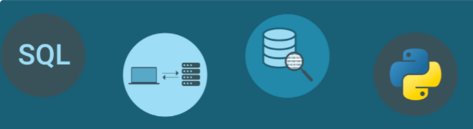

# Challenge_7: Financial Databases with SQL

UNCC Online FinTech Bootcamp Module 7 Challenge due by 11:59pm 1/23/2022

---

### Background

In recent years, finance has had an explosion in passive investing. **Passive investing** means that you invest in a basket of assets that’s called an exchange-traded fund (ETF). This way, you don’t spend time researching individual stocks or companies or take the risk of investing in a single stock. ETFs offer more diversification.

In this Challenge assignment, we’ll build a financial database and web application by using SQL, Python, and the Voilà library to analyze the performance of a hypothetical fintech ETF.

---

## What's Being Created

For this Challenge assignment, we will create and submit the following deliverables:

 - A Jupyter notebook that contains the following:

    1. An analysis of the ETF data that a SQL database stores.

    2. Professionally styled and formatted interactive visualizations.

 - A screenshot or video of the web application that has been created by deploying our Jupyter notebook via the Voilà library.

---

## Technologies

This application is written in Python 3.7 using JupyterLab version 3.0.14.

Python libraries used:
- Pathlib: [https://docs.python.org/3.7/library/pathlib.html](https://docs.python.org/3.7/library/pathlib.html)  
  *Pathlib is a library that enables consistent input and output of files from the main app.*
 - Pandas: [https://pandas.pydata.org/pandas-docs/stable/](https://pandas.pydata.org/pandas-docs/stable/)  
    *Pandas is is an open source, BSD-licensed library providing high-performance, easy-to-use data structures and data analysis tools for the Python programming language.*

 - hvPlot: [https://hvplot.holoviz.org/user_guide/Introduction.html](https://hvplot.holoviz.org/user_guide/Introduction.html)  
     *hvPlot is a high-level plotting API for the PyData ecosystem built on HoloViews.*
 - SQLAlchemy: [https://docs.sqlalchemy.org/en/13/dialects/sqlite.html?highlight=sqlite#connect-strings](https://docs.sqlalchemy.org/en/13/dialects/sqlite.html?highlight=sqlite#connect-strings)
     *The SQLAlchemy SQL Toolkit and Object Relational Mapper is a comprehensive set of tools for working with databases and Python.*

### Installation Guide

prior to running these libraries, install them from the command line:  
  - pandas: `conda install pandas` or `pip install pandas`  
  - pathlib: `pip install pathlib`
  - hvPlot: `conda install -c pyviz hvplot` or `pip install hvplot`
  - SQLAlchemy: `pip install SQLAlchemy`

---

## Usage

#### Deploy the Notebook as a Web Application

 1. Use the Voilà library to deploy your notebook as a web application. You can deploy the web application locally on your computer.

 2. Take a screen recording or screenshots to show how the web application appears when using Voilà. Include the recording or screenshots in the README.md file for your GitHub repository.
 

 
---
 
### Contributors

Geoff Tarleton - jobeycat@protonmail.com

adapted from Starter Code supplied by UNCC FinTech Online Bootcamp by Trilogy Educational Services, a 2U, Inc. brand.

---

### License

MIT
  